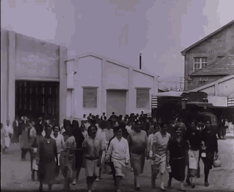

class: inverse, middle, center, hide-count

.mi-titulo[Para comenzar]

```{r xaringan-extra-styles, xaringanExtra,xaringan-editable, echo=FALSE}
xaringanExtra::use_extra_styles(
  hover_code_line = TRUE,         #<<
  mute_unhighlighted_code = TRUE  #<<
)

xaringanExtra::use_progress_bar(color = "#F1C40F", 
                                location = "bottom")

xaringanExtra::use_editable(expires = 1)

```

```{r xaringanExtra-clipboard, echo=FALSE}
htmltools::tagList(
  xaringanExtra::use_clipboard(
    button_text = "<i class=\"fa fa-clipboard\"></i>",
    success_text = "<i class=\"fa fa-check\" style=\"color: #90BE6D\"></i>",
    error_text = "<i class=\"fa fa-times-circle\" style=\"color: #F94144\"></i>"
  ),
  rmarkdown::html_dependency_font_awesome()
)
```

```{r setup, include=FALSE}
options(htmltools.dir.version = FALSE, OutDec = ",")
knitr::opts_chunk$set(
  echo = TRUE,
  message = FALSE, 
  warning = FALSE,
  hiline = TRUE
)
library(tidyverse)
library(magrittr)
library(wesanderson)
library(lubridate)
library(icons)
library(wordcloud2)
library(RColorBrewer)
library(tm)
library(xlsx)
library(tmap)
library(xaringanExtra)
library(tinytex)
library(ggthemes)
library(tidyverse)
library(janitor)
library(gtsummary)
library(knitr)
library(kableExtra)
```

```{r xaringan-themer, include=FALSE, warning=FALSE}
library(xaringanthemer)

style_duo_accent(
  primary_color = "#CD5C5C",
  secondary_color = "#F1C40F",
  inverse_header_color = "#000000",
  link_color = "orange",
  text_font_base = "Maipo-Sans"
)

```


---

class: inverse, middle, center, hide-count

.mi-titulo[¿ De qué se trata esta clase abierta?]


---

class: inverse, middle, center, hide-count

.mi-tcenter[

`r icons::icon_style(fontawesome("sun", style = "solid"), scale = 1, fill = "red")` Conocer a la Fundación SOL. 


`r icons::icon_style(fontawesome("hammer", style = "solid"), scale = 1, fill = "red")` Conocer los objetivos y contenidos de los cursos 2023.


 `r icons::icon_style(fontawesome("question", style = "solid"), scale = 1, fill = "red")` Resolver dudas sobre los cursos.
]

 

---


class: inverse, middle, center, hide-count

.mi-titulo[ Fundación SOL]


---

.mi-texto[
Somos un centro de investigación y acción que busca generar conocimiento crítico y
actividades para potenciar las luchas sociales y sindicales. Desde el año 2007, realizamos
diversas investigaciones  **orientadas a generar, difundir y aplicar conocimientos en torno
al mundo del trabajo, feminismos y economía**. Nuestra labor es por la disputa de ideas en
el espacio público, contribuyendo a levantar alternativas populares para el buen vivir.
]


---
class: center
background-image: url(img/fsol_1.png)
background-size: 65%
background-position: center

.bold-left[[Memoria anual Fundación SOL](https://www.fundacionsol.cl/quienes-somos#nav_tabs_content_1601315543158_18) ]
---
class: inverse, middle, center, hide-count
.mi-titulo[Objetivos y contenidos de los cursos 2023]

---

# A partir de marzo

--

.mi-texto[ 
* Automatización de visualizaciones para el fortalecimiento de las organizaciones
 ]
--
.mi-texto[
* Estadística descriptiva y visualización de información utilizando el lenguaje de programación R.]

--
.mi-texto[
* Economía política para el fortalecimiento sindical. ]

--


```{r echo=FALSE, out.width = "40%", fig.pos = "center"}


```

---
class: middle, center, inverse, hide-count

.mi-titulo[Economía política para el fortalecimiento sindical]

---

# Orientado a personas sindicalizadas

--

.pull-left[
Curso orientado a personas que formen parte de organizaciones sindicales y deseen profundizar en tópicos teóricos y prácticos de la economía. ]


--
.pull-left[
.bold[Se enfoca en una comprensión crítica de temas ahora tan cotidianos como IPC, PIB, inflación, crecimiento, entre otros. ]  ]

--
.pull-left[
.bold2[Horario:] Clases en vivo una vez por semana de 90 minutos, desde las 18:30. Comenzando el viernes 10 de marzo. ]

--
.pull-left[
.bold2[Metodología: ] Uso de diapositivas, vídeos y discusión colectiva de temas contigentes relacionado con los contenidos.]

---
.bold3[Clases]

.mi-texto[ 
1. Conceptos introductorios de estadística
2. Principales corrientes de la teoría económica	
3. Breve historia del sindicalismo en Chile	
4. Fuentes abiertas de información	
5. ¿Por qué es necesario aprender economía?
6. Salario mínimo y pensiones
7. Trabajo y salud
8. ¿Qué es y como podemos entender el presupuesto público?
9. Movimientos anti-sistémicos
10. Mitos y realidades sistema de AFP
11. Principales estadísticas de empleo en Chile]

--

```{r echo=FALSE, out.width = "40%", fig.pos = "center"}


```


--


```{r echo=FALSE, out.width = "30%", fig.pos = "center"}

knitr::include_graphics("img/statistics.gif")
```


---
class: inverse, middle, center, hide-count

.mi-titulo[Automatización de visualizaciones para el fortalecimiento de las organizaciones]

---
# Para aprender a generar reportes y *dashboard* usando R

--

.pull-left[
Curso orientado a personas que forman parte de organizaciones sociales o sindicales y desean crear visualizaciones de información para mejorar procesos internos o conocer información externa.

.bold[No requiere conocimientos avanzados de programación. ]
]


--
.pull-left[
.bold2[Horario:] Días lunes del 6 de marzo en adelante
 18:30 a 20:30 horas - online ]

--
.pull-left[
.bold2[Metodología: ] Uso de diapositivas y trabajo de código en el programa R. Considera dos clases taller con temas propuestos por estudiantes.]

---
.bold3[Clases]

.mi-texto[ 
1.  Conceptos introductorios de estadística.
2.  Introducción a **R**.
3.  Carga de datos y análisis exploratorio inicial en **R**. 
4.  Flujo de trabajo en **R**.
5.  ¿Por qué es importante la visualización de la información? 
6.  Elaboración de un *dashboard* estático I
7.  Elaboración de un *dashboard* estático II
8.  Elaboración de una aplicación para la visualización de información con **Shiny**.
9.  Elaboración y envío de reportes mediante el uso de técnicas de programación.
10. Taller de aplicación I y II.]

--

```{r echo=FALSE, out.width = "35%", fig.pos = "left"}


```

--

```{r echo=FALSE, out.width = "35%", fig.pos = "center"}


```


---
class: inverse, middle, center, hide-count

.mi-titulo[Estadística descriptiva y visualización de información utilizando el lenguaje de programación R]

---

# Para aprender y reforzar lo básico de estadística utilizando herramientas de R
--

.pull-left[
Curso orientado a personas que desean fortalecer sus conocimientos en cuanto a la Estadística descriptiva.

.bold[Este curso considera un nivel básico, por lo que es ideal para personas que deseen aprender bases estadísticas aunque no hayan tomado cursos del tema anteriormente ]
]

--
.pull-left[
.bold2[Horario:] Días miércoles desde el 8 de marzo al 17 de mayo 
 18:30 a 20:30 horas - online ]

--
.pull-left[
.bold2[Metodología:] Uso de diapositivas y trabajo de código en el programa R. Considera dos clases taller con temas propuestos por estudiantes.]

---
.bold3[Clases]

.mi-texto[ 
1.  Conceptos introductorios de estadística.
2. Introducción a **R**.
3. Carga de datos y análisis exploratorio inicial en **R**. 
4. Flujo de trabajo en **R**.
5. Estructura de datos y análisis descriptivo de la información  en **R**.
6. Estadística descriptiva univariada.
7. Representación gráfica de la información.
8. Herramientas para el análisis de datos.
9. Parametrización de reportes descriptivos con Rmarkdown.
10. Taller de aplicación I y II.]

--

```{r echo=FALSE, out.width = "25%", fig.pos = "left"}


```

--

```{r echo=FALSE, out.width = "35%", fig.pos = "center"}

knitr::include_graphics("img/happy-programmer-happy-coder.gif")
```
---
class: inverse, center, middle, hide-count

.mi-titulo[Resolver dudas sobre los cursos]


---
class: inverse, center, middle, hide-count

.mi-titulo[Trabajo con R]


---

```{r echo=FALSE}
#Debe correr estas líneas para que funcionen los tabset
xaringanExtra::use_panelset()
xaringanExtra::style_panelset_tabs(font_family = "Maipo Sans")


xaringanExtra::style_panelset_tabs(
  active_foreground = "#E5460F",
  hover_foreground = "#d22",
  font_family = "Maipo Sans"
)
```

.panelset[
.panel[.panel-name[R Código]
```{r oplot, fig.show='hide'}

# A continuación se utiliza la base de datos `Orange` que viene en R  #<<

library(ggplot2) #Libreria para diseñar gráficos #<<

  ggplot(Orange) + # Función para definir un 'lienzo'
  aes(x = age, y = circumference, colour = Tree) + # Para definir esteticas
  geom_point() + # Dibujar puntos en el gráfico 
  geom_line() + # Unir puntos con lineas
  guides(colour = "none") + # Quitar las leyendas
  theme_bw() # Definir Tema
```
]
.panel[.panel-name[Gráfico]

`)
]

.panel[.panel-name[Conclusión]

.mi-texto[Según el gráfico, mientras más edad tienen las naranjas mayor es su circunferencia. Esto ocurre en todos los tipos de árbol.]

]
]

---
.panelset.sideways[
```{r include=FALSE}

orange_panel_names <- c(
  source = "Código para generar un gráfico",
  output = "Gráfico de árboles"
)
```


```{r panelset = orange_panel_names}

# A continuación se utiliza la base de datos `Orange` que viene en R 

library(ggplot2) #Libreria para diseñar gráficos

  ggplot(Orange) + # Función para definir un 'lienzo'
  aes(x = age, y = circumference, colour = Tree) + # Para definir estéticas
  geom_point() + # Dibujar puntos en el gráfico
  geom_line() + # Unir puntos con lineas
  guides(colour = "none") + # Quitar las leyendas
  theme_bw() # Definir Tema
```


.panel[.panel-name[Conclusión]

.mi-texto[Según el gráfico, mientras más edad tienen las naranjas mayor es su circunferencia. Esto ocurre en todos los tipos de árbol.]

]


]


---
<div class="panelset">
  <div class="panel">
    <div class="panel-name"> ¿Cómo participar?</div>
     <p class = "bold2">
     Debes Inscribirte  <a href="http://fundacionsol.cl/survey/start/0c62c48b-21b4-4b80-b24c-3fbe478aca6d">haciendo click aquí</a></p>
      <p class="mi-texto"> 
     Todos los cursos consideran los siguiente: 
     <br></br>
     - Acceso a repositorio con bibliografía y material 
     de apoyo para clases.  </p> 
       <p class="mi-texto">- Clases una vez por semana, durante 11 semanas.</p>
       <p class="mi-texto">- Cápsulas de 30 minutos semanales como apoyo del contenido de clases. </p>
      <p class="mi-texto"> - Respuesta de consultas en diferido
vía correo electrónico.</p>
    </p>
  </div>
  <div class="panel">
    <div class="panel-name">¿Cuál es el costo?</div>
    
   <p class="mi-texto"> Pueden participar todas las personas que formen parte de la "Red de Donantes" de la Fundación SOL.  Se destinarán 15 becas de 100% del costo para donantes mensuales.  </p>

<p class="mi-texto"> Aquellas personas que no sean donantes mensuales, o que no hayan alcanzado una de las 15 becas, podrán acceder a cualquier curso por primera vez, con un aporte sugerido de $80.000. </p>

<p class="mi-texto"> Si aún no eres donante, inscríbete en 
www.fundacionsol.cl/dona-ahora  
y selecciona aporte mensual.</p>

<p class="mi-texto"> Los cupos para los cursos son limitados.</p>
  </div>
</div>


---
class: inverse, center, bottom, hide-count

background-image: url(img/logosol.png)
background-size: cover;  
background-position: center;
background-repeat: no-repeat;

.bold[Coordinación de los cursos:
Recaredo Gálvez Carrasco - recaredo.galvez@fundacionsol.cl]

.pie[www.fundacionsol.cl] 

---
class: image-sidebar-right hide-count
background-image:url("img/logo_rds.png")
background-size: 400px 401px
background-position: right


<div class="remark-slide-scaler" style="width: 1210px; height: 681px; transform: scale(0.664463); left: 0px; top: 444.25px;">
  <div class="remark-slide"><div class="remark-slide-content image-sidebar-right hljs-github">
    <h1 id="redSOL">Esta es una actividad de la red de Donantes SOL</h1>
    <p> Con tu aporte analizamos, revelamos y proponemos.</p>
    <div class="remark-slide-number">3</div></div>
  </div>
</div>

